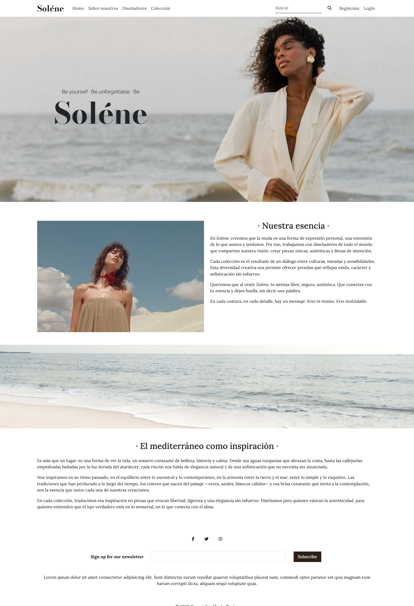
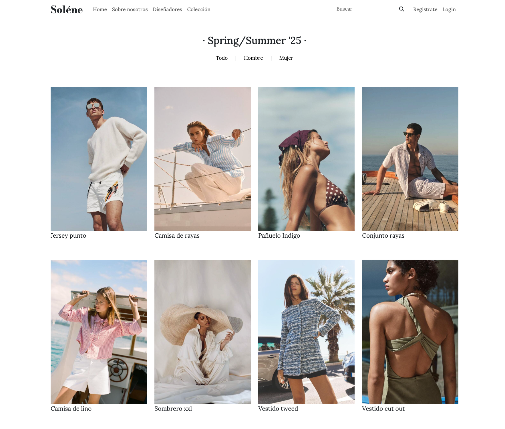
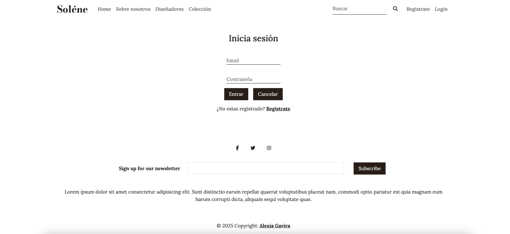
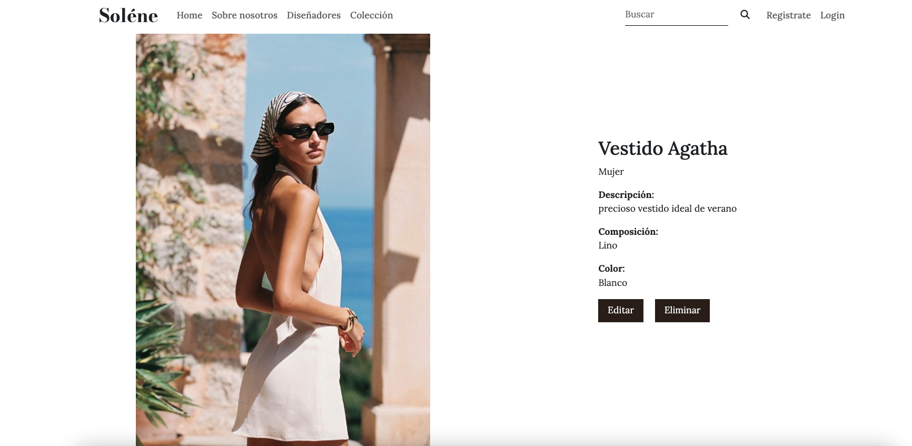

# 👩🏼‍🎨  Sólene - Fashion Social Network

Es una red social innovadora diseñada exclusivamente para diseñadores. Un espacio donde los creativos pueden mostrar su talento y construir una comunidad sólida en torno al diseño. 

Esta desarrollada con tecnologías como Node.js, Express y MySQL, la plataforma incorpora funciones clave como creación y eliminación de perfiles personalizados, relaciones entre el diseñador y sus diseños, validaciones de formularios y carga de imágenes.

## 📽️ Conoce el Proyecto

[](https://www.youtube.com/watch?v=8I1xXAe7Sj0)

# ✨ Funcionalidades

- Registro e inicio de sesión de diseñadores con validaciones
- Cifrado seguro de contraseñas con Bcrypt
- Subida de imágenes de perfil y diseños (Multer)
- Publicación de diseños con descripción y metadatos
- Relación 1:N entre diseñadores y sus diseños
- Eliminación lógica de diseñadores y diseños (is_deleted)
- Vistas dinámicas con EJS
- Diseño responsive adaptado a móviles y tablets
- Buscador por productos
- Filtro por sección de ropa de hombre y mujer
- Vistas de usuario y de administrador: Solo los usuarios registrados pueden editar y/o eliminar sus perfiles y sus diseños. El usuario normal sólo puede ver los perfiles sin hacer modificaciones.


# 🛠 Tecnologías usadas

## ⚙️ Backend
- Node.js
- Express
- MySQL2
- Multer
- JWT
- Bcrypt

## 💾 Base de Datos:
- MySQL

## 🎨 Frontend: 
- HTML5
- CSS3
- Bootstrap
- JavaScript

---

## 🚀 Despliegue del Proyecto


### ✅ 1. Instala Node.js
Descárgalo desde: [https://nodejs.org](https://nodejs.org)


### 🛠️ 2. Instala MySQL y MySQL Workbench
Descarga e instala desde: [https://dev.mysql.com/downloads/](https://dev.mysql.com/downloads/)


### 📦 3. Clona el repositorio

Clona este repositorio en tu PC local y accede a la carpeta del proyecto:

```bash
git clone https://github.com/Alexiag7/Fashion-Social-Network.git
cd Fashion-Social-Network
```

### 📥 4. Instalar dependencias

Dentro de la carpeta del proyecto, ejecuta el siguiente comando para instalar todas las dependencias necesarias:

```bash
npm install
```

### 🗄️ 5. Crea la base de datos en MySQL

Abre MySQL Workbench
Ejecuta el script SQL que está en la carpeta config/fashion.sql

### ▶️ 6. Levantar el servidor

Para iniciar la aplicación en modo desarrollo, ejecuta el siguiente comando:

```bash
npm run dev
```

### 🌐 8. Abre en el navegador

Accede a la app desde:
http://localhost:4000

---

## 📸 Capturas app







